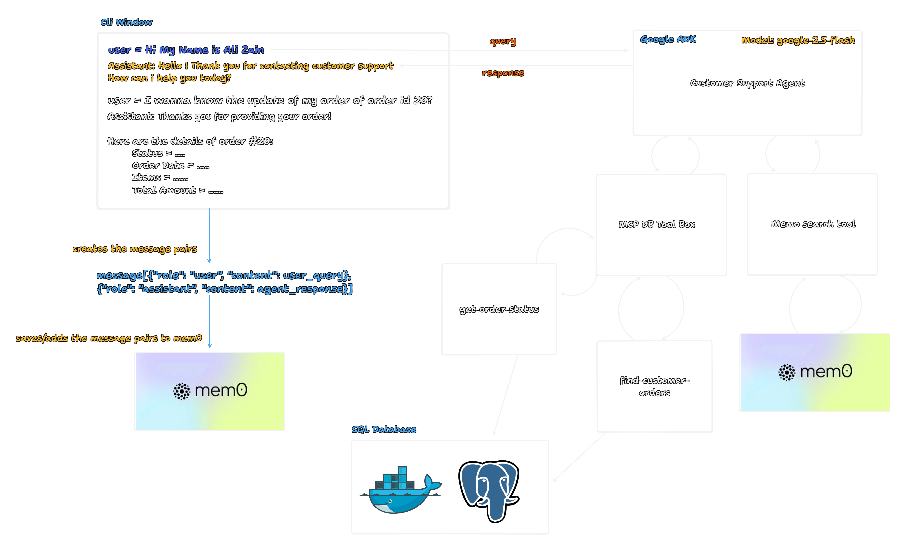

# Advance Customer Support Agent (CSA)

A sophisticated CLI-based customer support chatbot built with Google ADK (Agent Development Kit) and MCP Toolbox. The agent provides intelligent order management, proactive support logic, and persistent memory across conversations, all wrapped in a robust safety layer.

## Features

- 🤖 **Interactive CLI Interface** - Natural language conversation with the customer support agent.
- 📦 **Smart Order Management** - Lookup order status, history, and **modify order statuses** based on business rules.
- 🛡️ **LLM-based Guardrails** - Advanced safety patterns to ensure professional, secure, and helpful interactions.
- 🧠 **Persistent Memory** - Remembers past conversations and user preferences using **Mem0**.
- 🔄 **Session Management** - Maintains conversation context within a session.
- 🛠️ **Tool Integration** - Seamless integration with PostgreSQL via **MCP Toolbox**.

## Architecture


### Key Technologies

1. **Google ADK (Agent Development Kit)**
   - `Agent`: Defines the LLM agent with Gemini 2.5 Flash model.
   - `Runner`: Handles agent execution and event streaming.
2. **MCP Toolbox**
   - Connects to PostgreSQL and exposes database operations as MCP tools via HTTP API on `http://127.0.0.1:5000`.
3. **Mem0**
   - Persistent memory storage for long-term context-aware responses.
4. **Guardrails & Safety Patterns**
   - **Input/Output Filtering**: Uses specialized LLM prompts to validate queries and responses for safety, tone, and policy compliance before they reach the user or the database.

---

## Agent Capabilities & Business Logic

The agent is equipped with specific tools to manage the lifecycle of an order:

| Tool | Action | Description |
| :--- | :--- | :--- |
| `get-order-status` | **Query** | Retrieves current status, items, and total for a specific Order ID. |
| `find-customer-orders` | **Query** | Lists all historical orders associated with a customer email. |
| `update-order-status` | **Modify** | Updates order status based on specific customer satisfaction rules. |

---

## Prerequisites

- **Python 3.12+** - Required Python version
- **Docker** - For running PostgreSQL database
- **Google API Key** - For Google ADK (Gemini API)
- **Mem0 API Key** - For persistent memory functionality
- **MCP Toolbox** - Tool server for database operations

## Installation

### 1. Clone the Repository

```bash
git clone <repository-url>
cd <project-folder>
```

### 2. Install Dependencies

Create and activate a virtual environment, then install dependencies with `pip`:

```bash
# Create virtual environment
python -m venv .venv

# Activate virtual environment (Windows)
.venv\Scripts\activate

# Activate virtual environment (macOS/Linux)
source .venv/bin/activate

# Install dependencies
pip install -r requirements.txt
```

### 3. Set Up Environment Variables

Create a `.env` file in the project root with the following variables:

```bash
GOOGLE_GENAI_USE_VERTEXAI=0

# Google ADK API Key (required for Gemini model)
GOOGLE_API_KEY=your_google_api_key_here

# Mem0 API Key (required for persistent memory)
MEM0_API_KEY=your_mem0_api_key_here
```

**Note:** You can obtain:
- Google API Key from [Google AI Studio](https://makersuite.google.com/app/apikey)
- Mem0 API Key from [Mem0 Platform](https://mem0.ai/)

### 4. Set Up PostgreSQL Database

#### Using Docker (Recommended)

```bash
# Run PostgreSQL container
docker run --name some-postgres -e POSTGRES_PASSWORD=mysecretpassword -e POSTGRES_USER=toolbox_user -e POSTGRES_DB=toolbox_db -p 5432:5432 -d postgres
```

#### Access PostgreSQL Terminal (Optional)

```bash
# Execute postgres on terminal
docker exec -it some-postgres psql -U toolbox_user -d toolbox_db
```

### 5. Create Database Schema and Sample Data

Execute the following SQL in your PostgreSQL database:

<details>
<summary><strong>Show SQL (click to expand)</strong></summary>

## User data

```sql 
CREATE TABLE users ( 
   user_id SERIAL PRIMARY KEY, 
   email VARCHAR(255) UNIQUE NOT NULL, 
   full_name VARCHAR(100), 
   is_premium_customer BOOLEAN DEFAULT FALSE, 
   total_items_purchased INTEGER DEFAULT 0 
);
 INSERT INTO users (email, full_name, is_premium_customer, total_items_purchased) VALUES
   ('hannah.m@school.edu', 'Hannah M', TRUE, 94),
   ('charlie.d@webmail.com', 'Charlie D', TRUE, 88),
   ('julia.child@kitchen.com', 'Julia Child', TRUE, 75),
   ('evan.g@bizcorp.com', 'Evan G', TRUE, 56),
   ('alice.jones@example.com', 'Alice Jones', FALSE, 42),
   ('ian.malcolm@chaos.com', 'Ian Malcolm', FALSE, 31),
   ('diana.prince@hero.net', 'Diana Prince', FALSE, 23),
   ('george.j@jungle.com', 'George J', FALSE, 19),
   ('bob.smith@techmail.com', 'Bob Smith', FALSE, 15),
   ('fiona.shrek@swamp.com', 'Fiona Shrek', FALSE, 12);
```

## Customer Order Data

```sql
-- 📦 Create customer_orders table
CREATE TABLE customer_orders (
    order_id SERIAL PRIMARY KEY,
    customer_email VARCHAR(100) NOT NULL, 
    status VARCHAR(20) CHECK (status IN ('PROCESSING', 'SHIPPED', 'DELIVERED', 'CANCELLED', 'RETURNED')),
    items JSONB,
    order_date TIMESTAMPTZ DEFAULT NOW(),
    total_amount DECIMAL(10, 2)
);

-- 🛒 Insert demo customer orders
INSERT INTO customer_orders (customer_email, status, items, order_date, total_amount) VALUES
('alice.jones@example.com', 'DELIVERED', '[{"product": "Ergonomic Office Chair", "qty": 1, "price": 250.00}]', NOW() - INTERVAL '6 months', 250.00),
('alice.jones@example.com', 'DELIVERED', '[{"product": "Wireless Mouse", "qty": 1, "price": 25.00}, {"product": "Mouse Pad", "qty": 1, "price": 10.00}]', NOW() - INTERVAL '3 months', 35.00),
('alice.jones@example.com', 'SHIPPED', '[{"product": "Mechanical Keyboard", "qty": 1, "price": 120.00}]', NOW() - INTERVAL '2 days', 120.00),
('alice.jones@example.com', 'PROCESSING', '[{"product": "USB-C Hub", "qty": 1, "price": 45.00}]', NOW() - INTERVAL '1 hour', 45.00),

('bob.smith@techmail.com', 'DELIVERED', '[{"product": "Gaming Laptop 15-inch", "qty": 1, "price": 1500.00}, {"product": "Laptop Stand", "qty": 1, "price": 50.00}]', NOW() - INTERVAL '1 year', 1550.00),
('bob.smith@techmail.com', 'CANCELLED', '[{"product": "VR Headset", "qty": 1, "price": 400.00}]', NOW() - INTERVAL '10 days', 400.00),
('bob.smith@techmail.com', 'PROCESSING', '[{"product": "Curved Monitor 34-inch", "qty": 1, "price": 450.00}]', NOW() - INTERVAL '4 hours', 450.00),

('charlie.d@webmail.com', 'DELIVERED', '[{"product": "AA Batteries (Pack of 12)", "qty": 2, "price": 15.00}]', NOW() - INTERVAL '45 days', 30.00),
('charlie.d@webmail.com', 'DELIVERED', '[{"product": "HDMI Cable 6ft", "qty": 3, "price": 8.00}]', NOW() - INTERVAL '20 days', 24.00),

('diana.prince@hero.net', 'DELIVERED', '[{"product": "Smart Watch Gen 5", "qty": 1, "price": 299.00}]', NOW() - INTERVAL '60 days', 299.00),
('diana.prince@hero.net', 'RETURNED', '[{"product": "Running Shoes", "qty": 1, "price": 120.00}]', NOW() - INTERVAL '15 days', 120.00),

('evan.g@bizcorp.com', 'SHIPPED', '[{"product": "Office Desk", "qty": 2, "price": 300.00}, {"product": "Filing Cabinet", "qty": 2, "price": 150.00}]', NOW() - INTERVAL '1 day', 900.00),

('fiona.shrek@swamp.com', 'CANCELLED', '[{"product": "Skincare Gift Set", "qty": 1, "price": 85.00}]', NOW() - INTERVAL '5 days', 85.00),

('george.j@jungle.com', 'PROCESSING', '[{"product": "Bluetooth Speaker", "qty": 1, "price": 60.00}]', NOW() - INTERVAL '30 minutes', 60.00),

('hannah.m@school.edu', 'DELIVERED', '[{"product": "Notebook Pack", "qty": 5, "price": 12.00}, {"product": "Gel Pens", "qty": 2, "price": 5.00}]', NOW() - INTERVAL '4 months', 70.00),

('ian.malcolm@chaos.com', 'DELIVERED', '[{"product": "Professional Camera Lens", "qty": 1, "price": 2200.00}]', NOW() - INTERVAL '8 months', 2200.00),

('julia.child@kitchen.com', 'DELIVERED', '[{"product": "Coffee Beans 1kg", "qty": 1, "price": 25.00}]', NOW() - INTERVAL '3 months', 25.00),
('julia.child@kitchen.com', 'DELIVERED', '[{"product": "Coffee Beans 1kg", "qty": 1, "price": 25.00}]', NOW() - INTERVAL '2 months', 25.00),
('julia.child@kitchen.com', 'DELIVERED', '[{"product": "Coffee Beans 1kg", "qty": 1, "price": 25.00}]', NOW() - INTERVAL '1 month', 25.00),
('julia.child@kitchen.com', 'PROCESSING', '[{"product": "Coffee Beans 1kg", "qty": 1, "price": 25.00}, {"product": "Descaling Kit", "qty": 1, "price": 15.00}]', NOW() - INTERVAL '3 hours', 40.00);
```

</details>

### 6. Configure Database Connection

Update `mcp_toolbox/tools.yaml` with your database credentials:

```yaml
sources:
  customer_db:
    kind: postgres
    host: 127.0.0.1
    port: 5432
    database: toolbox_db
    user: toolbox_user
    password: mysecretpassword  # Update this to match your Docker setup
```

### 7. Install and Configure MCP Toolbox Server

Download the MCP Toolbox binary version 0.21.0 for **your OS and architecture** from the releases page:  
[genai-toolbox](https://github.com/googleapis/genai-toolbox/releases)

Once downloaded:

```bash
# 1) Move the toolbox binary into the mcp_toolbox folder
mv toolbox* mcp_toolbox/

# 2) (Linux/macOS only) Make the toolbox binary executable
cd mcp_toolbox
chmod +x toolbox
```

On Windows, ensure the downloaded file is named `toolbox.exe` and placed inside the `mcp_toolbox` folder.

The MCP Toolbox must be running before starting the agent. In a separate terminal:

```bash
# Navigate to toolbox directory
cd mcp_toolbox

# Start the toolbox server
./toolbox.exe --tools-file tools.yaml

# Or with UI enabled [Recommended]
./toolbox.exe --tools-file tools.yaml --ui
```

The toolbox will start on `http://127.0.0.1:5000` by default.

## Usage

### Running the CLI Chatbot

Once all services are running (PostgreSQL, MCP Toolbox), start the agent:

```bash
# Run the main agent CLI
uv run python cs_agent/agent_cli.py

```

### Running with ADK Web Interface

For a web-based interface:

```bash
# Terminal 1: Start MCP Toolbox with UI
cd mcp_toolbox
./toolbox.exe --tools-file tools.yaml --ui

# Terminal 2: Start ADK Web interface
adk web
```

## Project Structure

```
Advance-Customer-Support-Agent/
├── cs_agent/              # Main agent package
│   ├── agent_cli.py       # CLI entry point
│   ├── memory.py          # Mem0 memory integration
│   ├── greet.py           # Greeting flow
│   └── prompts.py         # Agent instruction prompts
├── mcp_toolbox/           # MCP Toolbox configuration
│   ├── toolbox.exe        # MCP Toolbox executable
│   └── tools.yaml         # Database tool definitions
├── requirements.txt       # Python dependencies
├── diagram.png            # Architecture diagram
└── README.md              # Documentation 
```

## How It Works

### Agent Flow

1. **User Input**: User types a message in the CLI
2. **Session Management**: Runner creates/retrieves session for the user
3. **Memory Search**: Agent searches Mem0 for relevant past conversations
4. **Tool Selection**: Agent determines which tools to use (if any):
   - `search_memory`: Search past conversations
   - `get-order-status`: Query specific order by ID
   - `find-customer-orders`: Find all orders for a customer email
5. **Tool Execution**: MCP Toolbox executes database queries
6. **Response Generation**: Agent formats and returns response
7. **Memory Storage**: Conversation is saved to Mem0 at session end

### Agent Configuration

The agent is configured in `cs_agent/agent.py`:

- **Model**: `gemini-2.5-flash` (Google Gemini)
- **Tools**: Database tools from MCP Toolbox + Mem0 memory tool
- **Session Service**: `InMemorySessionService` (in-memory session storage)
- **Instructions**: Defined in `cs_agent/prompts.py`

### Tool Definitions

Tools are defined in `mcp_toolbox/tools.yaml`:

- **`get-order-status`**: Retrieves order details by numeric Order ID
  - Parameter: `order_id` (integer)
  - Returns: status, order_date, total_amount, items

- **`find-customer-orders`**: Finds all orders for a customer email
  - Parameter: `customer_email` (string)
  - Returns: List of orders sorted by date (newest first)

## Agent Capabilities

The customer support agent can:

- ✅ **Order Status Queries**: "What's the status of order 5?"
- ✅ **Customer Order History**: "Show me all orders for alice@example.com"
- ✅ **Natural Language Processing**: Understands various phrasings
- ✅ **Context Awareness**: Remembers past conversations via Mem0
- ✅ **Professional Responses**: Friendly, clear, and helpful communication
- ✅ **Error Handling**: Gracefully handles missing data or invalid queries

## Assumptions

1. **Database Schema**: The PostgreSQL database has a `customer_orders` table with the expected schema (see SQL above)

2. **MCP Toolbox**: The MCP Toolbox server is running on `http://127.0.0.1:5000` before starting the agent

3. **API Keys**: Valid Google API key and Mem0 API key are set in `.env` file

4. **User Identification**: The agent uses a default `USER_ID` ("demo" in `agent.py`, "demo_cli" in `agent_cli.py`). In production, this should be dynamically set per user

5. **Session Management**: Sessions are stored in-memory. For production, consider using a persistent session service

6. **Order ID Format**: Order IDs are numeric integers (e.g., 1, 5, 20). The agent handles normalization automatically

7. **Customer Identification**: Customers are identified by email address, not customer ID

8. **Memory Storage**: Mem0 is used for persistent memory. Conversations are saved at the end of each session

## Troubleshooting

### Error: Connection refused to http://127.0.0.1:5000

**Solution**: Ensure MCP Toolbox is running:
```bash
cd mcp_toolbox
./toolbox.exe --tools-file tools.yaml
```

### Error: Database connection failed

**Solutions**:
- Verify PostgreSQL container is running: `docker ps`
- Check database credentials in `mcp_toolbox/tools.yaml`
- Ensure database exists: `docker exec -it some-postgres psql -U toolbox_user -d toolbox_db`

### Error: Missing API key

**Solution**: Create `.env` file with required keys:
```bash
GOOGLE_API_KEY=your_key_here
MEM0_API_KEY=your_key_here
```

### Error: Module not found

**Solution**: Install dependencies:
```bash
uv sync
```

### Unclosed client session warnings

**Status**: These are expected warnings from the async HTTP client and can be safely ignored. They don't affect functionality.

### Agent not using tools correctly

**Solution**: 
- Check MCP Toolbox logs for tool execution errors
- Verify tool definitions in `mcp_toolbox/tools.yaml`
- Ensure database schema matches tool expectations

### Memory not persisting

**Solution**:
- Verify `MEM0_API_KEY` is set correctly
- Check Mem0 API service status
- Review `cs_agent/memory.py` for correct user_id usage

## Development

### Modifying Agent Behavior

- **Prompts**: Edit `cs_agent/prompts.py` to change agent instructions
- **Tools**: Modify `mcp_toolbox/tools.yaml` to add/change database tools
- **Memory**: Adjust memory functions in `cs_agent/memory.py`

### Adding New Tools

1. Add tool definition to `mcp_toolbox/tools.yaml`
2. Add tool to `cs_agent_tools` toolset
3. Restart MCP Toolbox server
4. The agent will automatically have access to the new tool

## Resources

- **MCP Toolbox Colab Notebook**: [Getting Started Guide](https://colab.research.google.com/github/googleapis/genai-toolbox/blob/main/docs/en/getting-started/colab_quickstart.ipynb#scrollTo=QqRlWqvYNKSo)
- **Google ADK Documentation**: [https://google.github.io/adk-docs/](https://google.github.io/adk-docs/)
- **Mem0 Documentation**: [https://docs.mem0.ai/](https://docs.mem0.ai/)
- **MCP Protocol**: [Model Context Protocol](https://modelcontextprotocol.io/)


